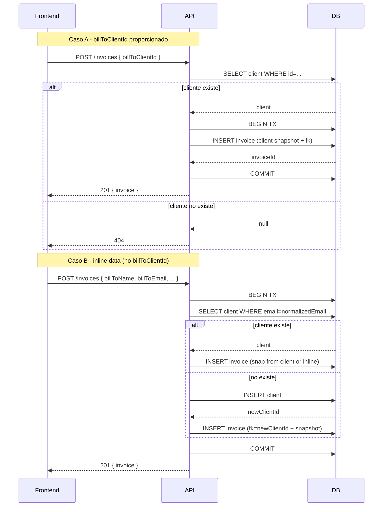

# Invoice: comportamiento por campo (resumen)

## Propósito

Describir qué ocurre para cada campo importante al crear/actualizar una factura. Incluye flujos, validaciones, transacciones y pruebas recomendadas.

## Campo: fromCompanyId

- Tipo: UUID | '' | undefined
- Semántica:
  - Si se proporciona un UUID válido:
    1. Validar si existe la compañía en la base de datos.
       - Si no existe => devolver error 404.
       - Si existe => enlazar la factura a la compañía (foreign key).
  - Si NO se proporciona:
    1. Buscar si el usuario tiene una compañía "Sole Proprietor" (tipo por defecto).
       - Si existe => usar esa compañía.
       - Si no existe => crear una nueva compañía "Sole Proprietor" para el usuario.
    2. Enlazar la factura a la compañía encontrada/creada.
- Transacciones: todo debe ejecutarse en una transacción ACID (crear compañía + crear factura), rollback en errores.
- Idempotencia/duplicate checks: usar constraints y comprobar existence antes de crear.
- Logging/Audit: registrar: decisión tomada (usedExistingCompany / createdCompany), companyId y invoiceId.

## Campo: billToClientId

- Tipo: UUID | '' | undefined
- Semántica:
  - Si se proporciona un UUID válido:
    1. Validar formato (schema).
    2. Verificar que exista el cliente en la base de datos.
       - Si no existe => devolver error 404 (no crear cliente automáticamente).
       - Si existe => enlazar la factura al cliente (foreign key).
    3. Copiar/actualizar los campos de facturación de la factura (name, email, phone, address, ...) desde el perfil del cliente actual al snapshot de la factura.
    4. Guardar factura con relación al cliente.
  - Si NO se proporciona:
    1. Requerir campos inline (billToFullName, billToEmail, billToPhone) mínimos.
    2. Validar datos inline (email formato, phone, etc).
    3. Comprobar si existe cliente con (email || phone || unique identifier):
       - Si existe => opcional: enlazar al cliente existente o devolver conflicto según política.
       - Si no existe => crear cliente nuevo dentro de la misma transacción.
    4. Guardar factura con relación al cliente recientemente creado (o sin relación si política lo indica).
- Transacciones: todo debe ejecutarse en una transacción ACID (crear cliente + crear factura), rollback en errores.
- Idempotencia/duplicate checks: usar constraints y comprobar existence antes de crear.
- Logging/Audit: registrar: decisión tomada (usedExistingClient / createdClient), clientId y invoiceId.

## Campo: billToFullName, billToEmail, billToPhone, billToAddress, etc.

- Tipo: varios (string, email, phone, address)
- Semántica:
  - Si billToClientId es proporcionado:
    1. Ignorar estos campos inline (usar snapshot del cliente).
  - Si billToClientId NO es proporcionado:
    1. Validar todos los campos inline (formato, longitud, etc).
    2. Usar estos datos para crear el snapshot de facturación en la factura.
- Transacciones: n/a (manejado en el flujo de billToClientId).
- Idempotencia/duplicate checks: n/a (manejado en el flujo de billToClientId).
- Logging/Audit: n/a (manejado en el flujo de billToClientId).

## Campo: issueDate, dueDate

- Tipo: string (ISO date)
- Semántica:
  - Validar formato ISO date.
  - issueDate debe ser <= dueDate.
- Transacciones: n/a.
- Idempotencia/duplicate checks: n/a.
- Logging/Audit: registrar fechas proporcionadas.

## Campo: taxRate

- Tipo: number (porcentaje)
- Semántica:
  - Validar que sea un número entre 0 y 100.
  - Aplicar tasa por defecto (13%) si no se proporciona.
- Transacciones: n/a.
- Idempotencia/duplicate checks: n/a.
- Logging/Audit: registrar tasa aplicada.

## Campo: notes, logoUrl

- Tipo: string (texto libre), string (URL)
- Semántica:
  - notes: opcional, longitud máxima 1000 caracteres.
  - logoUrl: opcional, validar formato URL si se proporciona.
- Transacciones: n/a.
- Idempotencia/duplicate checks: n/a.
- Logging/Audit: registrar si se proporcionaron.

## Campo: lineItems

- Tipo: array de objetos (description, quantity, unitPrice, total)
- Semántica:
  - Validar que haya al menos un ítem.
  - Validar cada ítem (descripción no vacía, cantidad > 0, unitPrice >= 0).
  - Calcular total de la factura sumando lineItems.
- Transacciones: n/a.
- Idempotencia/duplicate checks: n/a.
- Logging/Audit: registrar número de ítems y total calculado.

## Campo: status

- Tipo: enum (draft, issued, partial, paid, overdue, cancelled, void)
- Semántica:
  - Validar que el valor esté dentro del enum permitido.
  - Por defecto, establecer como 'draft' si no se proporciona.
- Transacciones: n/a.
- Idempotencia/duplicate checks: n/a.
- Logging/Audit: registrar estado inicial de la factura.

## Pruebas recomendadas

- Unit tests:
  - billToClientId válido y cliente existe -> factura enlazada y snapshot coincide.
  - billToClientId válido y cliente NO existe -> 404 error.
  - billToClientId vacío -> crea cliente nuevo cuando no existe, factura enlazada.
  - Inline data que coincide con cliente existente -> política "link vs create" comprobada.
- Integration tests: flujos con BD real en transacción y rollback.

## API contract / errores

- 201: factura creada exitosamente
- 200: factura actualizada exitosamente
- 400: validación Zod
- 404: cliente no encontrado (cuando billToClientId proporcionado)
- 422: datos inline insuficientes (cuando billToClientId no proporcionado)
- 500: error interno del servidor
- 409: conflicto (si inline intenta crear cliente que viola unique constraints)

## Notas de implementación

- Usar SELECT ... FOR UPDATE si se requiere evitar races en comprobación/creación de cliente.
- Normalizar email/phone antes de comparar.
- Guardar snapshot de datos cliente en la factura para histórico.

## Diagramas

