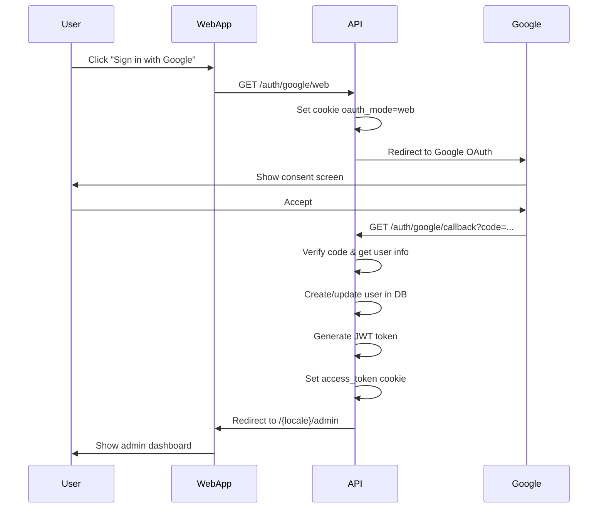

# Fix: Google OAuth para Aplicación Web

## 🐛 Problema Identificado

La autenticación de Google OAuth en la aplicación web (Next.js) estaba devolviendo un error 500 después de seleccionar la cuenta de Google. El usuario era redirigido a:

```
http://localhost:3000/auth/google/callback?iss=https%3A%2F%2Faccounts.google.com&code=...
```

Y recibía:

```json
{
  "statusCode": 500,
  "message": "Internal server error"
}
```

## 🔍 Causa Raíz

El problema era que la aplicación web estaba llamando directamente al endpoint `/auth/google` sin establecer una cookie `oauth_mode` para indicar que la solicitud venía del navegador web. Esto causaba que el callback no supiera cómo manejar el redirect correctamente.

**Diferencia entre Mobile y Web:**

- **Mobile** (`/auth/google/mobile`): Establece cookie `oauth_mode=mobile` → Redirige a deep link de la app
- **Web**: NO tenía endpoint deFalló al dicado → procesar el callback

## ✅ Solución Implementada

### 1. Nuevo Endpoint: `/auth/google/web`

Se agregó un endpoint dedicado para la aplicación web que establece una cookie antes de iniciar el flujo OAuth:

```typescript
// src/auth/auth.controller.ts

// Sign in with Google OAuth for web
@Get('google/web')
@UseGuards(PassportAuthGuard('google'))
googleAuthWeb(@Req() req?: Request, @Res() res?: Response) {
  // Establecer una cookie temporal para marcar que es web
  if (res) {
    res.cookie('oauth_mode', 'web', {
      httpOnly: true,
      secure: process.env.STAGE !== 'dev',
      sameSite: 'lax',
      maxAge: 1000 * 60 * 5, // 5 minutos
      path: '/',
    });
  }
  return;
}
```

### 2. Callback Mejorado

Se actualizó el callback para:

- Establecer `oauth_mode='web'` por defecto si no hay cookie
- Manejar errores con try/catch y redirigir a página de error
- Limpiar correctamente la cookie después de usarla

```typescript
@Get('google/callback')
@UseGuards(PassportAuthGuard('google'))
async googleCallback(@Req() req: Request, @Res() res: Response) {
  try {
    const oauthMode = (req.cookies as any)?.oauth_mode || 'web';
    const result = await this.authService.signInWithGoogle(req.user);

    res.clearCookie('oauth_mode', { path: '/' });

    if (oauthMode === 'mobile') {
      // Redirect a mobile app
      const mobileScheme = process.env.MOBILE_APP_SCHEME ?? 'ascenciotaxapp';
      const redirectUrl = `${mobileScheme}://auth/google/callback?access_token=${encodeURIComponent(result.access_token)}`;
      return res.redirect(redirectUrl);
    }

    // Redirect a web app (por defecto)
    const cookieDomain = process.env.AUTH_COOKIE_DOMAIN;
    res.cookie('access_token', result.access_token, {
      httpOnly: true,
      secure: process.env.STAGE !== 'dev',
      sameSite: 'lax',
      ...(cookieDomain ? { domain: cookieDomain } : {}),
      maxAge: 1000 * 60 * 60 * 24 * 7,
      path: '/',
    });

    const webAppUrl = process.env.WEB_APP_URL ?? 'http://localhost:4000';
    const locale = result.user.locale || 'en';
    const successPath = `/${locale}/admin`;
    const redirectUrl = new URL(successPath, webAppUrl);

    return res.redirect(redirectUrl.toString());
  } catch (error) {
    console.error('❌ Error in Google OAuth callback:', error);
    const webAppUrl = process.env.WEB_APP_URL ?? 'http://localhost:4000';
    const errorUrl = new URL('/en/signin?error=google_auth_failed', webAppUrl);
    return res.redirect(errorUrl.toString());
  }
}
```

### 3. Actualización del Frontend Web

Se actualizó el botón de "Sign in with Google" para usar el nuevo endpoint:

```typescript
// components/auth/signin-form.tsx

<Button
  variant="outline"
  type="button"
  onClick={() => {
    try {
      const base = process.env.NEXT_PUBLIC_API_URL || 'http://localhost:3001';
      const u = new URL(base);
      const apiBasePath = u.pathname.replace(/\/$/, '');
      const oauthUrl = `${u.origin}${apiBasePath}/auth/google/web`; // ← Cambio aquí
      window.location.href = oauthUrl;
    } catch (e) {
      console.error('Invalid NEXT_PUBLIC_API_URL', e);
    }
  }}
>
  {dict.signInWithGoogle}
</Button>
```

## 🔐 Configuración Requerida en Google Cloud Console

⚠️ **MUY IMPORTANTE**: La URI de callback debe coincidir EXACTAMENTE con la configurada en tu `.env`

⚠️ **LIMITACIÓN DE GOOGLE**: Google OAuth NO permite usar IPs privadas (como `192.168.18.29:3000`) en las redirect URIs. Solo acepta:

- ✅ `localhost` o `127.0.0.1` para desarrollo local
- ✅ Dominios públicos con HTTPS para producción
- ❌ IPs privadas (192.168.x.x, 10.x.x.x, 172.16.x.x, etc.)

### Paso 1: Ir a Google Cloud Console

1. Visita: https://console.cloud.google.com/apis/credentials
2. Selecciona tu proyecto
3. Encuentra tu "OAuth 2.0 Client ID" para Web
4. Click en el nombre para editarlo

### Paso 2: Agregar URIs Autorizadas

En **"Authorized redirect URIs"**, agrega:

**Desarrollo Local** (ÚNICA opción válida para desarrollo):

```
http://localhost:3000/auth/google/callback
```

**Producción:**

```
https://api.ascenciotax.com/auth/google/callback
```

⚠️ **Reglas importantes:**

- NO incluyas `/web` o `/mobile` en el callback - solo `/auth/google/callback`
- NO uses IPs privadas - Google las rechazará
- Para desarrollo, SIEMPRE usa `localhost` o `127.0.0.1`
- Usa el protocolo correcto (`http://` para desarrollo, `https://` para producción)
- La URI debe coincidir EXACTAMENTE con `GOOGLE_CALLBACK_URL` en tu `.env`

### Paso 3: Guardar y Esperar

Click en "SAVE" y **espera 5-10 minutos** para que Google propague los cambios.

### 💡 ¿Qué hacer si necesitas acceder desde otros dispositivos?

Si necesitas probar desde tu móvil o desde otra computadora en la misma red:

**Opción 1: Usar ngrok (Recomendado para pruebas)**

```bash
# Instalar ngrok: https://ngrok.com/download
ngrok http 3000

# Ngrok te dará una URL pública como:
# https://abc123.ngrok.io

# Actualizar .env:
GOOGLE_CALLBACK_URL="https://abc123.ngrok.io/auth/google/callback"

# Agregar en Google Cloud Console:
# https://abc123.ngrok.io/auth/google/callback
```

**Opción 2: Configurar dominio local (Avanzado)**

```bash
# En /etc/hosts (Linux/Mac) o C:\Windows\System32\drivers\etc\hosts (Windows)
# Agregar:
192.168.18.29  dev.ascenciotax.local

# Luego usar:
GOOGLE_CALLBACK_URL="http://dev.ascenciotax.local:3000/auth/google/callback"

# Nota: Aún así Google puede rechazarlo si no es un dominio público
```

**Opción 3: Usar localhost y proxy inverso (Más complejo)**

- Configurar nginx como proxy inverso
- Todos los dispositivos acceden vía localhost con túnel SSH

## 📋 Variables de Entorno

⚠️ **CRÍTICO**: Para desarrollo local, SIEMPRE usa `localhost` porque Google OAuth no permite IPs privadas.

### API (.env)

```bash
GOOGLE_CLIENT_ID="tu-client-id.apps.googleusercontent.com"
GOOGLE_CLIENT_SECRET="tu-client-secret"
GOOGLE_CALLBACK_URL="http://localhost:3000/auth/google/callback"
WEB_APP_URL="http://localhost:4000"
MOBILE_APP_SCHEME="ascenciotaxapp"
```

### Web (.env)

```bash
NEXT_PUBLIC_API_URL=http://localhost:3000
WEB_APP_URL=http://localhost:4000
```

⚠️ **NO uses IPs privadas** como `192.168.18.29` - Google las rechazará.

## 🚨 Troubleshooting: Error "Unauthorized" o "TokenError"

Si recibes este error en los logs del servidor:

```
[ERROR] [ExceptionsHandler] Unauthorized
TokenError: Unauthorized
    at OAuth2Strategy.parseErrorResponse
```

**Causa:** Desajuste entre las URLs configuradas o uso de IPs privadas.

### Checklist de Solución:

1. **Verificar que AMBOS archivos usen `localhost`:**

   ```bash
   # En ascencio-tax-api/.env
   GOOGLE_CALLBACK_URL="http://localhost:3000/auth/google/callback"

   # En ascencio-tax-web/.env
   NEXT_PUBLIC_API_URL=http://localhost:3000
   ```

   ⚠️ **NO uses IPs como `192.168.18.29` - Google las rechaza**

2. **Verificar Google Cloud Console:**
   - Ve a: https://console.cloud.google.com/apis/credentials
   - Edita tu OAuth 2.0 Client ID
   - En "Authorized redirect URIs", verifica que esté EXACTAMENTE:
     ```
     http://localhost:3000/auth/google/callback
     ```
   - Guarda y espera 5-10 minutos

3. **Reiniciar el servidor API:**

   ```bash
   cd ascencio-tax-api
   # Ctrl+C para detener
   npm run start:dev
   ```

   Verifica en los logs:

   ```
   ✓ Callback URL: http://localhost:3000/auth/google/callback
   ```

4. **Probar de nuevo:**
   - Ir a la web: `http://localhost:4000/en/signin`
   - Click "Sign in with Google"
   - Debería funcionar ahora

### ¿Por qué pasa esto?

Cuando usas Passport Google OAuth:

1. Tu app redirige al usuario a Google con un `redirect_uri` de callback
2. Google verifica que ese `redirect_uri` esté en la lista autorizada
3. Si NO está, Google NO redirige de vuelta → Token error "Unauthorized"

**Limitaciones de Google OAuth:**

- ❌ NO acepta IPs privadas (`192.168.x.x`, `10.x.x.x`, etc.)
- ✅ Solo acepta `localhost` / `127.0.0.1` para desarrollo
- ✅ Solo acepta dominios públicos con HTTPS para producción

El `redirect_uri` se construye desde el `GOOGLE_CALLBACK_URL` en tu `.env`, por eso debe coincidir exactamente con lo configurado en Google Cloud Console.

## 🧪 Pruebas

1. **Web**: Ir a `/signin` → Click en "Sign in with Google" → Seleccionar cuenta → Debería redirigir a `/admin`
2. **Mobile**: Usar el flujo nativo con `/auth/google/verify` → Debería funcionar sin cambios
3. **Mobile OAuth** (si existe): Usar `/auth/google/mobile` → Debería redirigir a deep link

## 📌 Notas Importantes

- ✅ **Mobile NO afectado**: El flujo de autenticación móvil (`/auth/google/verify` y `/auth/google/mobile`) NO fue modificado
- ✅ **Backward compatible**: El endpoint `/auth/google` sigue funcionando, pero ahora web usa `/auth/google/web`
- ✅ **Error handling**: Si falla OAuth, redirige a `/signin?error=google_auth_failed`
- ✅ **Cookies con path**: Las cookies ahora se limpian correctamente con `path: '/'`

## 🚀 Deployment

Después de desplegar estos cambios:

1. Reiniciar el servidor API: `npm run start:dev` (desarrollo) o `npm run build && npm run start:prod` (producción)
2. Verificar que no hay errores de compilación
3. Probar el flujo completo de Google OAuth en web
4. Verificar que mobile sigue funcionando correctamente

## 🔄 Flujo Actualizado


